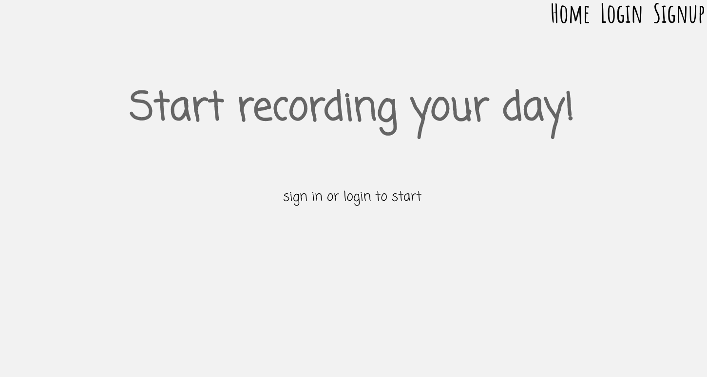
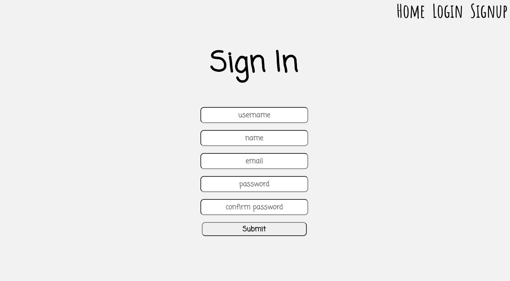
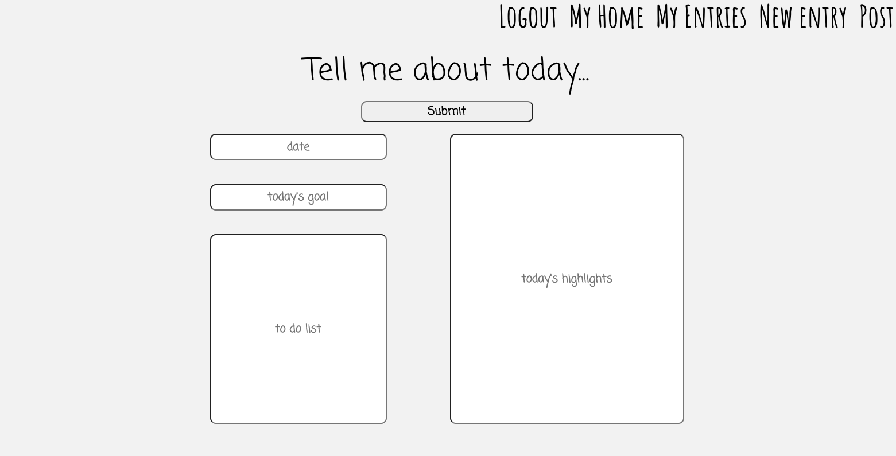

# Journal
## Date: 03/26/22
## By: Ran Kim
****

### Description
#### With everyday passing by in a blink of an eye, setting daily goals to better yourself, and cherishing small moments in life can be hard. Create your daily to do lists, set your goals, and record the highlights of your day with JOURNAL.
****
### Get Started
- Fork and Clone
- git add and git commit all changes
****
### Technologies Used
|  | 
 |
 |
 |
 |

 |
 |
 |
 |
****
### Using the website

#### Signup or login! 

#### Record your daily entries.
[Journal](https://pacific-island-05171.herokuapp.com/)
****
### Credits
- https://Stackoverflow.com/
- https://developer.mozilla.org/
- https://www.w3schools.com/

****
### Coming Soon...
- [ ] user authentication
- [ ] page to post/comment and interact with other users

****
### Links
[Trello](https://trello.com/b/WSZWHz5i/journal) | [Journal](https://pacific-island-05171.herokuapp.com/)
